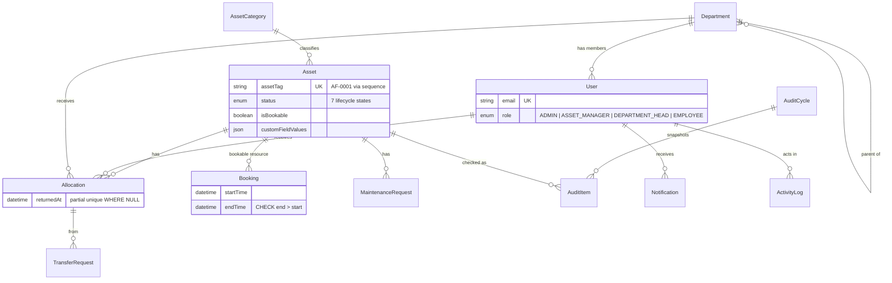

# AssetFlow

### Enterprise asset & resource management — without the spreadsheet chaos

**Track · Allocate · Book · Maintain · Audit** physical assets from one system.
Built in **6 hours** as a full-stack hackathon product: real Express + PostgreSQL API, real JWT/RBAC, real UI — **no BaaS, no mock JSON, no dead buttons**.

```
┌──────────────────────────────────────────────────────────────────────────┐
│  Login  →  Dashboard  →  Org  →  Assets  →  Allocations  →  Bookings     │
│           Maintenance  →  Audits  →  Reports  →  Activity & Alerts       │
└──────────────────────────────────────────────────────────────────────────┘
```

| | |
|---|---|
| **Stack** | Express · TypeScript · Prisma · PostgreSQL · React · Vite · Tailwind · TanStack Query |
| **Auth** | JWT access (15m) + rotating refresh (7d) · bcrypt · 4-role RBAC |
| **Data** | Schema-first migrations · partial unique indexes · CHECK constraints · row locks |
| **Team** | Karthik (core backend) · Vishnu (UI & dashboard) · Ann (advanced modules) |

---

## Why it exists

Organizations still track laptops, rooms, and tools in shared sheets. That breaks the moment two people allocate the same asset, book the same room, or “fix” an audit offline. AssetFlow is the operational spine for that mess:

- **One source of truth** for asset lifecycle (7 states, one status machine)
- **Conflict-safe allocation & booking** — races lose in the database, not in a meeting
- **Approval workflows** for transfers, maintenance, and audits
- **Live KPIs, heatmaps, CSV exports** — analytics on real endpoints
- **Full activity trail + notifications** so nothing is a black box

---

## Features — 10 screens that all hit a real API

| # | Screen | What you get |
|---|--------|--------------|
| 1 | **Login / Signup** | JWT + rotating refresh, forgot/reset password, field-level validation. Signup **only** creates Employees. |
| 2 | **Dashboard** | Six live KPI cards, overdue returns (red / needs action) vs upcoming, role-aware quick actions. |
| 3 | **Organization Setup** | Department hierarchy + heads, category custom-field builder, employee directory — **the only place roles change**. |
| 4 | **Asset Directory** | Category-driven registration, sequence tags (`AF-0001`), search/filter across 7 lifecycle states, detail with history. |
| 5 | **Allocation & Transfers** | Conflict-safe allocate → structured **409** → “held by…” modal → one-click transfer request → approve / return with condition. |
| 6 | **Resource Booking** | Week calendar; overlap-free bookings in a transaction; rejected slots name the conflict; back-to-back is legal. |
| 7 | **Maintenance** | Request → approve (asset → *Under maintenance*) → assign tech → in progress → resolve. Illegal jumps = 409. |
| 8 | **Asset Audit** | Scoped cycles, Verified / Missing / Damaged checklist, live discrepancies; close applies consequences atomically. |
| 9 | **Reports & Analytics** | Utilization top-10, idle assets, maintenance by category, dept summary, day×hour heatmap, **real CSV exports**. |
| 10 | **Activity & Notifications** | Unread badges, mark-read, full filterable who-did-what log. |

---

## Architecture at a glance

```
                    ┌─────────────┐
   Browser          │  React UI   │  Vite · TanStack Query · RHF + Zod
   :5173            │  /api proxy │
                    └──────┬──────┘
                           │  /api/v1/*
                    ┌──────▼──────┐
                    │   Express   │  routes → controller → service → Prisma
   :4000            │  JWT + RBAC │  Zod in · uniform error envelope out
                    └──────┬──────┘
                           │
                    ┌──────▼──────┐
                    │ PostgreSQL  │  migrations + raw-SQL guards
                    │  + Prisma   │  FOR UPDATE on contended rows
                    └─────────────┘
```

**Layering (backend):** routes declare paths and role gates → controllers validate HTTP with Zod → services own transactions and invariants (never see `req`/`res`) → Prisma is the only data access path.

**Error envelope (everywhere):**

```json
{
  "error": {
    "code": "ASSET_ALREADY_ALLOCATED",
    "message": "Human-readable sentence.",
    "details": { "fields": { "email": "…" }, "heldBy": { "name": "…" } }
  }
}
```

Zod issues become `details.fields` for inline form errors. Workflow conflicts become UI modals — the allocation conflict modal is built entirely from a 409 payload.

Deeper write-up: [`_build/ARCHITECTURE.md`](./_build/ARCHITECTURE.md) · API surface: [`_build/API.md`](./_build/API.md)

---

## Database decisions we will defend

1. **Partial unique index = double-allocation guard**  
   `UNIQUE (assetId) WHERE returnedAt IS NULL` — the service builds a friendly 409; the index is the last line of defense under concurrency.

2. **Sequence-generated asset tags**  
   `AF-0001` via `nextval` — never `count + 1`. Concurrency-safe, gap-tolerant.

3. **CHECK constraints for shape invariants**  
   Booking `endTime > startTime`; allocation/transfer targets are **exactly one of** user XOR department — in the schema, not only in TypeScript.

4. **Lock first, constrain last**  
   Allocation, booking overlap, transfer approval, and audit close run in `$transaction` with `SELECT … FOR UPDATE` on the contended row.

5. **State machines as data**  
   All asset status changes go through one choke point (`transitionAssetStatus`). Maintenance has its own 6-state map. Illegal transitions are explicit 409s.



---

## Tech stack (and why)

| Layer | Choice | Why |
|-------|--------|-----|
| API | Express 4 + TypeScript | Boring, auditable HTTP; typed handlers end to end |
| ORM / DB | Prisma 6 + PostgreSQL 16 | Schema-first migrations; raw SQL where the DSL can't express constraints |
| Validation | Zod (server + client) | One vocabulary; server messages surface inline in the UI |
| Auth | JWT + bcrypt | Hand-rolled = no Firebase/Supabase shortcut; rotating refresh hashes server-side |
| UI | React 19 + Vite 8 + Tailwind v4 | Fast iteration; design tokens in CSS; one status→color system |
| Server state | TanStack Query | Cache + invalidation by key; zero server data in `useState` |
| Forms | react-hook-form + Zod | Client mirrors server schemas |
| Charts | Recharts | Live endpoints; CVD-aware palette |

---

## Quick start

**Prereqs:** Node.js 20+ (verified on 24.x), npm, and PostgreSQL 15+ (or Docker).

Use the verified app tree in **`_build/`** (or reconstruct with `./assemble.sh` → `assembled/`).

```bash
# 0) Optional: rebuild assembled/ from hourly teammate drops
./assemble.sh          # hours 1..6 → ./assembled/
# ./assemble.sh 3      # checkpoint through hour 3

# 1) Database
cd _build              # or: cd assembled
docker compose up -d

# 2) Backend  →  http://localhost:4000
cd backend
cp .env.example .env
npm install
npx prisma migrate dev
npx prisma db seed
npm run dev

# 3) Frontend  →  http://localhost:5173  (proxies /api → :4000)
cd ../frontend
npm install
npm run dev
```

Health check: `GET http://localhost:4000/api/v1/health` → `{"status":"ok"}`

```bash
cd _build/backend && npm test   # unit + integration (allocation conflicts, booking overlap, RBAC, …)
```

### Environment (backend)

Copy `backend/.env.example`. Typical local values match Docker Compose:

| Variable | Purpose |
|----------|---------|
| `DATABASE_URL` | Postgres connection string |
| `JWT_ACCESS_SECRET` / `JWT_REFRESH_SECRET` | Token signing |
| `CORS_ORIGIN` | Frontend origin (e.g. `http://localhost:5173`) |
| `PORT` | API port (default `4000`) |

---

## Seeded logins

| Email | Password | Role |
|-------|----------|------|
| `admin@assetflow.io` | `Admin@123` | Admin |
| `meera@assetflow.io` | `Demo@123` | Asset Manager |
| `arjun@assetflow.io` | `Demo@123` | Department Head (Engineering) |
| `sneha@assetflow.io` | `Demo@123` | Department Head (Operations) |
| `priya@assetflow.io` (+ other employees) | `Demo@123` | Employee |

**Demo data hooks already planted:** Priya holds laptop `AF-0001` with a pending transfer; Karan has an overdue allocation; maintenance requests sit across five workflow stages; one audit cycle is open mid-progress and one is closed with discrepancies; two weeks of bookings feed the calendar and heatmap.

---

## 90-second demo path

1. Sign in as **admin** → Dashboard: live KPIs + one overdue return in red.
2. **Assets → Register** → pick *Electronics* → warranty custom field appears → save → toast with `AF-####`.
3. **Allocations → Allocate** to Priya → allocate again to Rahul → **conflict modal** (“held by Priya”) → **Request transfer**.
4. Transfers → **Approve** → history shows both → **Return** with condition notes → asset Available.
5. **Bookings** → Meeting Room A1 → 9:00–10:00 → try 9:30–10:30 (named overlap) → 10:00–11:00 (back-to-back OK).
6. **Maintenance** → approve pending → asset status *Under maintenance* → assign → start → resolve.
7. **Audits** → mark Damaged → discrepancy report updates → close (optional): missing → Lost, damaged → auto maintenance.
8. **Reports** → charts + heatmap → export CSV.
9. Bell icon → notifications from the session; **Activity** → full trail.

---

## Project layout

```
AssetFlow/
├── README.md                 ← you are here
├── ASSEMBLY.md               ← how hourly drops reconstruct the app
├── assemble.sh               ← overlay Hour 1..N into ./assembled/
├── context/                  ← problem statement, research, organizers’ brief
├── _drops/                   ← per-person hourly zip archives
├── _build/                   ← verified full application (run this)
│   ├── README.md
│   ├── ARCHITECTURE.md
│   ├── API.md
│   ├── docker-compose.yml
│   ├── backend/
│   │   ├── prisma/           # schema, migrations, seed
│   │   ├── src/
│   │   │   ├── config/       # zod-validated env
│   │   │   ├── lib/          # prisma, jwt, status machine, csv, …
│   │   │   ├── middleware/   # auth, rbac, rate-limit, errors
│   │   │   └── modules/      # domain: routes → controller → service
│   │   └── tests/
│   └── frontend/
│       └── src/
│           ├── api/          # typed client + types
│           ├── components/   # ui primitives, shared status system, layout
│           ├── features/     # one folder per screen
│           └── lib/          # auth context, forms, formatters
└── assembled/                # output of ./assemble.sh (same shape as _build)
```

Hourly assembly semantics and merge order: see **[ASSEMBLY.md](./ASSEMBLY.md)**.

---

## Roles & permissions (high level)

| Capability | Admin | Asset Manager | Dept Head | Employee |
|------------|:-----:|:-------------:|:---------:|:--------:|
| Org setup / role changes | ✓ | | | |
| Register & manage assets | ✓ | ✓ | | |
| Allocate / approve transfers (org-wide) | ✓ | ✓ | | |
| Allocate / approve within department | ✓ | ✓ | ✓ | |
| Book resources | ✓ | ✓ | ✓ | ✓ |
| Raise maintenance | ✓ | ✓ | ✓ | ✓ |
| Approve maintenance / run audits | ✓ | ✓ | | |
| Reports & CSV | ✓ | ✓ | scoped | limited |
| Own allocations & notifications | ✓ | ✓ | ✓ | ✓ |

Coarse gates live in middleware (`requireRole`); fine-grained scoping lives in services. The UI hides what a role cannot do — **the API enforces it**.

---

## Scripts cheat sheet

| Where | Command | Does |
|-------|---------|------|
| `backend/` | `npm run dev` | API with hot reload (`tsx watch`) |
| `backend/` | `npm test` | Vitest unit + integration |
| `backend/` | `npm run db:seed` | Re-seed demo data |
| `backend/` | `npm run db:studio` | Prisma Studio |
| `frontend/` | `npm run dev` | Vite dev server |
| `frontend/` | `npm run build` | Production build |
| repo root | `./assemble.sh [N]` | Rebuild `assembled/` through hour N |

---

## Design principles (short version)

- **Derived state is computed, never stored** — booking UPCOMING/ONGOING/COMPLETED and “overdue” come from the clock at read time.
- **Friendly errors, hard constraints** — services explain; the database makes bad states impossible.
- **One notification path** — `notify()` / `notifyRole()` so every module emits the same shape.
- **Activity log inside the same transaction** as the change — a rolled-back action leaves no ghost trail.
- **Honest stand-ins over fake polish** — password-reset links log to the server console instead of pretending an email SaaS exists.

---

## Docs map

| Doc | Contents |
|-----|----------|
| [ASSEMBLY.md](./ASSEMBLY.md) | Reconstruct from hourly teammate folders |
| [_build/README.md](./_build/README.md) | App-focused README (same product story) |
| [_build/ARCHITECTURE.md](./_build/ARCHITECTURE.md) | Layering, locks, RBAC, state machines |
| [_build/API.md](./_build/API.md) | Endpoint reference |
| [context/](./context/) | Problem statement & hackathon brief |

---

## License & status

Hackathon / portfolio project — **ISC** on the backend package metadata. Not a commercial product release.

Built under a six-hour clock with hourly merges. Every screen above is wired to live data.

---

<p align="center">
  <strong>AssetFlow</strong> — know what you own, who has it, and what happens next.
</p>
